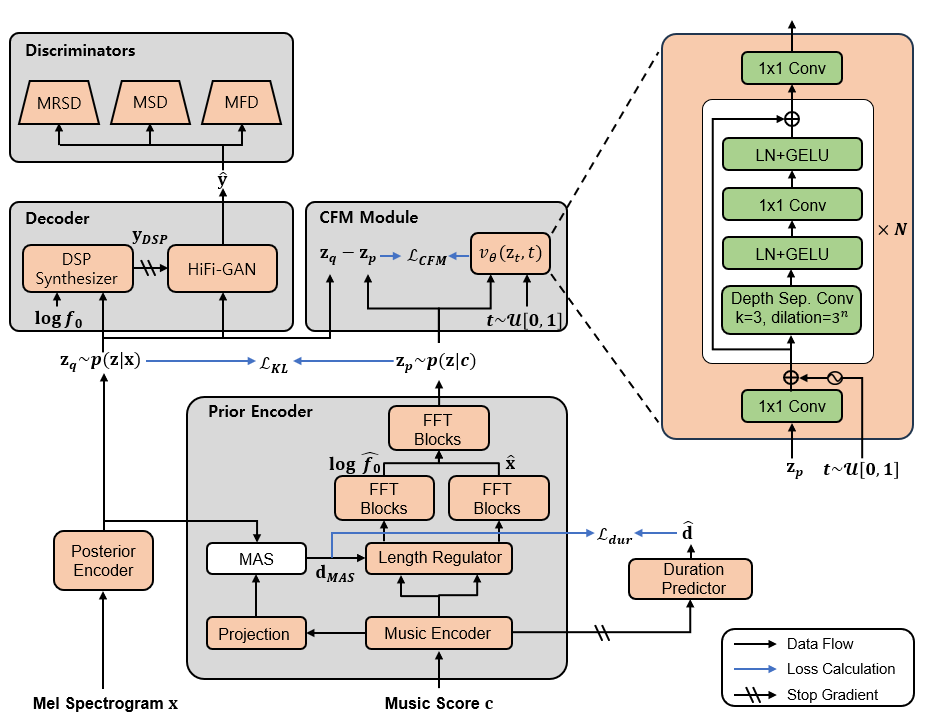

<table>
    <tr>
        <td>
            <p align="center">
                <br>
                <b>FM-Singer Architecture</b>
            </p>
        </td>
    </tr>
</table>

## FM-Singer: Latent Flow Matching for Expressive Singing Voice Synthesis

#### Minhyeok Yun, Yong-Hoon Choi

[[Paper]](https://github.com/alsgur9368/FM-Singer) - [[Code]](https://github.com/alsgur9368/FM-Singer) - [[Demo]](https://alsgur9368.github.io/Singing-Voice-Synthesis-Demo/Web_dir/) - [[Weights]](https://drive.google.com/drive/folders/1IIVTKc1AUzcXRVhnfGfQDWunc5YabYGy?usp=drive_link)

## Getting Started

### Dependencies

python version=3.8.10

You can install the Python dependencies with
```
pip install -r requirements.txt
```

#### Datasets

The supported dataset is

- [AI Hub dataset](https://aihub.or.kr/aihubdata/data/view.do?dataSetSn=465): This paper used datasets from 'The Open AI Dataset Project (AI-Hub, S. Korea)'. All data information can be accessed through 'AI-Hub (www.aihub.or.kr)'.

### Training

Train with

```
bash bash/train.sh [GPU num defualt 0]
```

### Inference
```
python inference.py
```

## References
### Codes
- [zhangyongmao's VISinger2](https://github.com/zhangyongmao/VISinger2)
- [jaywalnut310's VITS](https://github.com/lucidrains/conformer)
- [atong01's TorchCFM](https://github.com/atong01/conditional-flow-matching)
### Papers
- [VISinger 2: High-Fidelity End-to-End Singing Voice Synthesis Enhanced by Digital Signal Processing Synthesizer](https://arxiv.org/abs/2211.02903)
- [VISinger: Variational Inference with Adversarial Learning for End-to-End Singing Voice Synthesis](https://arxiv.org/abs/2110.08813)
- [Period Singer: Integrating Periodic and Aperiodic Variational Autoencoders for Natural-Sounding End-to-End Singing Voice Synthesis](https://arxiv.org/abs/2406.09894)
- [Flow Matching for Generative Modeling](https://arxiv.org/abs/2210.02747)
